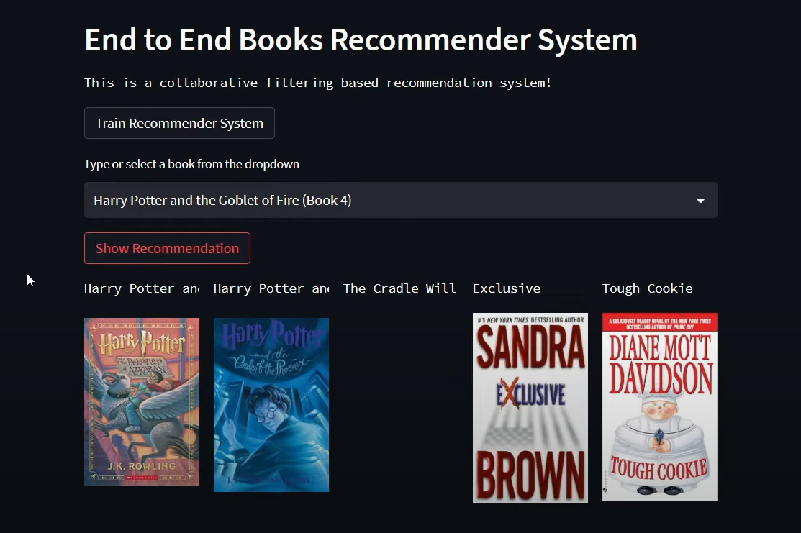

# Book-Recommender-System


# 📚 Collaborative Book Recommendation System

A personalized book recommendation system built using collaborative filtering. It suggests similar books based on user preferences using K-Nearest Neighbors (KNN) and presents them with cover images through an interactive Streamlit app.

---

## 🚀 Features

- 🔍 Recommend similar books based on a selected book
- 📈 Trained using real-world dataset (`Book-Crossing`)
- 🎯 Collaborative filtering using user-based similarity
- 📷 Displays book cover images
- 🌐 Built with Streamlit for web-based interaction

---

## 🧠 How It Works

1. Loads book-user rating data
2. Preprocesses and builds a **pivot table**
3. Trains a **KNN model** to find similar books
4. Saves the model and required files as `.pkl`
5. Streamlit frontend allows you to:
   - Select a book
   - Get 5 recommendations with images

---

## 🗂️ Project Structure

```

Book-Recommender-System/
├── notebook/
│   ├── research.ipynb            # Exploratory notebook
│   ├── BX-Books.csv              # Book metadata
│   ├── BX-Users.csv              # User data
│   ├── BX-Book-Ratings.csv       # Ratings data
│   └── artifacts/
│       ├── model.pkl
│       ├── book\_names.pkl
│       ├── book\_pivot.pkl
│       └── final\_rating.pkl
├── app.py                        # Streamlit app
├── requirements.txt              # Dependencies
├── README.md                     # Project documentation

````

---

## ⚙️ Setup Instructions

### 1. Clone the Repository

```bash
git clone https://github.com/your-username/book-recommender-system.git
cd book-recommender-system
````

### 2. Create a Virtual Environment (Optional)

```bash
python -m venv .venv
.\.venv\Scripts\activate   # On Windows
```

### 3. Install Dependencies

```bash
pip install -r requirements.txt
```

### 4. Run the Streamlit App

```bash
streamlit run app.py
```

---

## 📸 Demo Screenshot

## 📸 Demo




---

## 🧪 Dataset Source

* [Book-Crossing Dataset](https://www.kaggle.com/datasets/saurabhbagchi/books-dataset)

  * Includes metadata on books, users, and ratings
  * Used for collaborative filtering

---

## 📦 Requirements

* Python 3.7+
* streamlit
* pandas
* scikit-learn
* numpy
  (Install with: `pip install -r requirements.txt`)

---

## 💡 Future Enhancements

* Add user authentication
* Add hybrid (content + collaborative) recommendations
* Deploy to Streamlit Cloud / Hugging Face Spaces
* Show book details (author, year, description)

---

## 🙋‍♂️ Author

* Abhay Thakre
* Final Year Student, VJTI Mumbai
* [LinkedIn](https://www.linkedin.com/in/abhay-thakre-a402b1370/)

---

## ⭐ Contributions

Pull requests and feedback are welcome!
Feel free to fork the repo and suggest improvements.

---

## 📝 License

This project is open-source under the MIT License.

````

---

### ✅ How to update it:

1. Replace `README.md` in your project folder with this.
2. Commit and push:
```bash
git add README.md
git commit -m "Update README with project details"
git push
````

Let me know if you'd like to include:

* Deployment instructions (e.g., Streamlit Cloud)
* Google Colab notebook badge
* A working YouTube demo or screenshot URL
